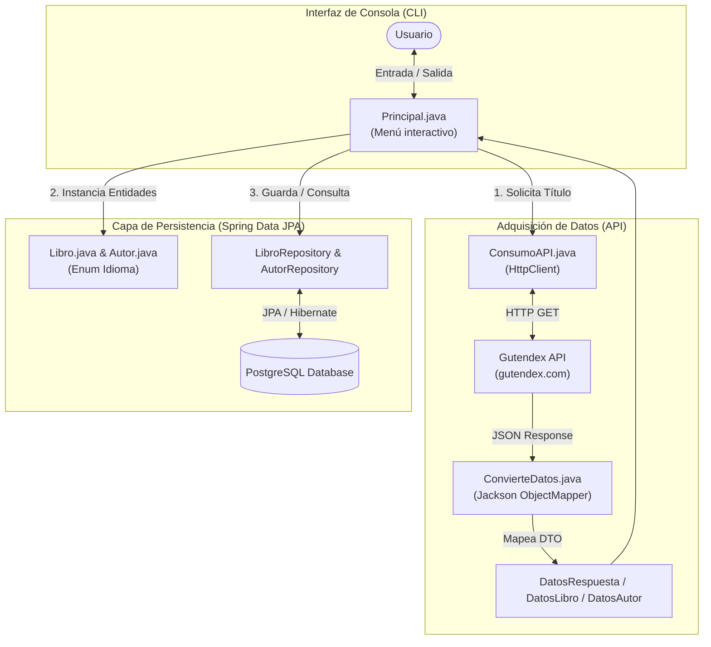

# 📚 LiterAlura - Catálogo Interactivo de Libros CLI

<p align="center">
  
</p>


> Aplicación de consola basada en **Spring Boot** que interactúa con la API REST de **Gutendex**, realiza mapeo objeto-relacional (ORM) con **Spring Data JPA / Hibernate**, persiste información en **PostgreSQL** y ofrece un menú de análisis literario con filtros avanzados.

---

## 📋 Tabla de Contenidos

- [🎯 Descripción y Objetivos](#-descripción-y-objetivos)
- [✨ Funcionalidades](#-funcionalidades)
- [🏗️ Arquitectura y Flujo de Datos](#️-arquitectura-y-flujo-de-datos)
- [🌐 Integración con API Externa (Gutendex)](#-integración-con-api-externa-gutendex)
- [🧪 Pruebas Unitarias e Integración](#-pruebas-unitarias-e-integración)
- [🚀 Guía de Instalación y Ejecución](#-guía-de-instalación-y-ejecución)
  - [Opción 1: Ejecución Local con Maven y PostgreSQL](#opción-1-ejecución-local-con-maven-y-postgresql)
  - [Opción 2: Despliegue con Docker Compose](#opción-2-despliegue-con-docker-compose)
- [📁 Estructura del Proyecto](#-estructura-del-proyecto)
- [🤝 Créditos y Contacto](#-créditos-y-contacto)

---

## 🎯 Descripción y Objetivos

**LiterAlura** resuelve la necesidad de buscar, catalogar y analizar datos sobre literatura clásica internacional. Utiliza la arquitectura en capas recomendada por el ecosistema **Spring Framework**, garantizando separación de responsabilidades:

- **Deserialización dinámica de JSON:** Mapeo de respuestas complejas utilizando Jackson (`@JsonAlias`, `@JsonIgnoreProperties`).
- **Modelado Relacional N:M / 1:N:** Gestión de relaciones JPA entre la entidad `Libro` y la entidad `Autor` con enums personalizados (`Idioma`).
- **Persistencia en SGBD:** Consultas derivadas (`Derived Queries`) y JPQL personalizadas mediante `Spring Data JPA`.

---

## ✨ Funcionalidades

| Opción | Funcionalidad | Descripción |
| :---: | :--- | :--- |
| **1** | 🔍 **Buscar libro por título** | Consulta la API Gutendex, deserializa la información y persiste el libro junto con su autor en BD. |
| **2** | 📚 **Listar libros registrados** | Muestra todos los libros almacenados localmente en la base de datos. |
| **3** | 👥 **Listar autores registrados** | Lista todos los autores guardados con sus respectivos libros asociados. |
| **4** | 📅 **Autores vivos en un año** | Filtra autores cuya fecha de nacimiento y fallecimiento coincidan con el año consultado. |
| **5** | 🌍 **Filtrar libros por idioma** | Muestra los libros registrados filtrados por código ISO (`es`, `en`, `fr`, `pt`). |
| **6** | 📊 **Estadísticas avanzadas** | Genera estadísticas de descargas (Promedio, Máximo, Mínimo) usando `DoubleSummaryStatistics`. |

---

## 🏗️ Arquitectura y Flujo de Datos

### Diagrama de Arquitectura (Mermaid)



---

## 🌐 Integración con API Externa (Gutendex)

El proyecto consume la API pública **[Gutendex](https://gutendex.com/)**, un servicio REST basado en el catálogo del *Project Gutenberg*.

### Endpoint Principal

```http
GET https://gutendex.com/books/?search={titulo_o_autor}
```

### Ejemplo de Respuesta JSON Deserializada:

```json
{
  "count": 1,
  "results": [
    {
      "id": 1513,
      "title": "Romeo and Juliet",
      "authors": [
        {
          "name": "Shakespeare, William",
          "birth_year": 1564,
          "death_year": 1616
        }
      ],
      "languages": ["en"],
      "download_count": 31540
    }
  ]
}
```

### Probar Endpoint vía cURL:

```bash
curl -X GET "https://gutendex.com/books/?search=don%20quijote"
```

---

## 🧪 Pruebas Unitarias e Integración

El proyecto implementa pruebas de integración para los repositorios de Spring Data y pruebas unitarias con **Mockito** para el servicio de conversión de datos.

### Ejemplo de Prueba Unitarias (`ConvierteDatosTest.java`)

```java
package com.aluracursos.literalura;

import com.aluracursos.literalura.model.DatosRespuesta;
import com.aluracursos.literalura.service.ConvierteDatos;
import org.junit.jupiter.api.DisplayName;
import org.junit.jupiter.api.Test;

import static org.junit.jupiter.api.Assertions.*;

class ConvierteDatosTest {

    private final ConvierteDatos conversor = new ConvierteDatos();

    @Test
    @DisplayName("Debe deserializar correctamente la respuesta JSON de Gutendex")
    void debeDeserializarJsonRespuesta() {
        String jsonSimulado = """
                {
                  "count": 1,
                  "results": [
                    {
                      "id": 1,
                      "title": "Cien años de soledad",
                      "languages": ["es"],
                      "download_count": 500
                    }
                  ]
                }
                """;

        DatosRespuesta resultado = conversor.obtenerDatos(jsonSimulado, DatosRespuesta.class);

        assertNotNull(resultado);
        assertEquals(1, resultado.resultadoLibros().size());
        assertEquals("Cien años de soledad", resultado.resultadoLibros().get(0).titulo());
    }
}
```

### Ejecutar las Pruebas:

```bash
mvn test
```

---

## 🚀 Guía de Instalación y Ejecución

### Requisitos Previos

- **Java JDK 17** o superior.
- **Maven 3.8+**.
- **PostgreSQL** instalado o servidor de base de datos accesible.
- **Docker & Docker Compose** *(Opcional)*.

---

### Opción 1: Ejecución Local con Maven y PostgreSQL

1. **Clonar el repositorio:**
   ```bash
   git clone https://github.com/SamySierraDV/AluraLatam-Litealura.git
   cd AluraLatam-Litealura
   ```

2. **Configurar la base de datos:**
   Asegúrate de crear una base de datos en PostgreSQL llamada `literalura`. Modifica el archivo `src/main/resources/application.properties` con tus credenciales:
   ```properties
   spring.datasource.url=jdbc:postgresql://localhost:5432/literalura
   spring.datasource.username=tu_usuario
   spring.datasource.password=tu_contraseña
   spring.jpa.hibernate.ddl-auto=update
   ```

3. **Compilar y Ejecutar:**
   ```bash
   mvn clean spring-boot:run
   ```

---

### Opción 2: Despliegue con Docker Compose

Puedes levantar la base de datos PostgreSQL y ejecutar la aplicación en contenedores aislados sin configurar nada localmente.

#### 1. Crear el archivo `docker-compose.yml` en la raíz:

```yaml
version: '3.8'

services:
  postgres-db:
    image: postgres:15-alpine
    container_name: literalura-db
    environment:
      POSTGRES_DB: literalura
      POSTGRES_USER: postgres
      POSTGRES_PASSWORD: postgrespassword
    ports:
      - "5432:5432"
    volumes:
      - pgdata:/var/lib/postgresql/data

  app:
    build: .
    container_name: literalura-app
    depends_on:
      - postgres-db
    environment:
      SPRING_DATASOURCE_URL: jdbc:postgresql://postgres-db:5432/literalura
      SPRING_DATASOURCE_USERNAME: postgres
      SPRING_DATASOURCE_PASSWORD: postgrespassword
    stdin_open: true
    tty: true

volumes:
  pgdata:
```

#### 2. Levantar el entorno Docker:

```bash
docker-compose up --build
```

---

## 📁 Estructura del Proyecto

```text
src/
├── main/
│   ├── java/com/aluracursos/literalura/
│   │   ├── model/          # DTOs, Entidades JPA (Libro, Autor) y Enums (Idioma)
│   │   ├── repository/     # Interfaces Spring Data JPA (LibroRepository, AutorRepository)
│   │   ├── service/        # Lógica de consumo de API (ConsumoAPI) y Deserialización (ConvierteDatos)
│   │   ├── principal/      # Menú interactivo CLI (Principal.java)
│   │   └── LiteraluraApplication.java # Clase principal Spring Boot
│   └── resources/
│       └── application.properties # Configuración de Spring/Database
└── test/                   # Pruebas unitarias e integración con JUnit 5 & Mockito
```

---

## 🤝 Créditos y Contacto

Desarrollado por **Samy Sierra Suárez** como parte del Challenge **Oracle Next Education (ONE) G9 – Back End** en alianza con **Alura Latam**.

[](https://www.linkedin.com/in/samy-sierra-dev)
[](https://github.com/SamySierraDV)
